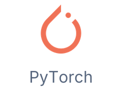
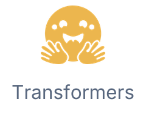
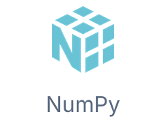
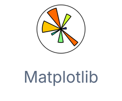
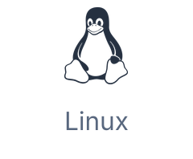
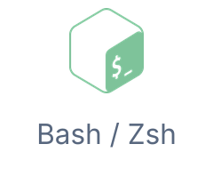
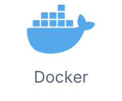
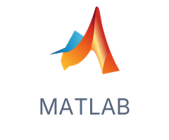
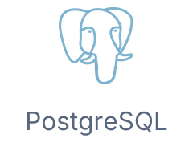

# Md Rysul Kabir

**Computer Science Ph.D. student** 
Indiana University Bloomington

## About Me

I work on **LLM post-training and interpretability**, **reinforcement learning**, and **Bayesian modeling**. I study how learning methods, memory, and internal representations shape model behavior.

My work spans training and evaluating language models, building agents with temporal memory, and fitting probabilistic models to cognitive and behavioral data.

---

## Expertise 🔬

- **LLM post-training:** Supervised fine-tuning and reinforcement learning with verifiable rewards.
- **Evaluation & interpretability:** Model behavior, safety evaluation, and representation analysis.
- **Reinforcement learning & memory:** Time-scale invariant memory and temporal decision-making.
- **Bayesian modeling & inference:** Hierarchical models for cognitive and behavioral data.

---

## Links 📫

- 🌐 **[Personal website](https://mdrkabir.github.io/homepage/)** — research projects and publications
- 📚 **[Google Scholar](https://scholar.google.com/citations?user=-BT9-3AAAAAJ&hl=en)**
- 💼 **[LinkedIn](https://www.linkedin.com/in/mdrysulkabir/)**

---

## Tech Stack 🛠️

### LLM & deep learning

  <a href="https://pytorch.org/" title="PyTorch"><picture>
    <source media="(prefers-color-scheme: dark)" srcset="assets/profile-v4/tool-pytorch-dark.png">
    <source media="(prefers-color-scheme: light)" srcset="assets/profile-v4/tool-pytorch-light.png">
    
  </picture></a>
  <a href="https://huggingface.co/docs/transformers/" title="Transformers"><picture>
    <source media="(prefers-color-scheme: dark)" srcset="assets/profile-v4/tool-transformers-dark.png">
    <source media="(prefers-color-scheme: light)" srcset="assets/profile-v4/tool-transformers-light.png">
    
  </picture></a>
  <a href="https://github.com/verl-project/verl" title="verl"><picture>
    <source media="(prefers-color-scheme: dark)" srcset="assets/profile-v4/tool-verl-dark.png">
    <source media="(prefers-color-scheme: light)" srcset="assets/profile-v4/tool-verl-light.png">
    
  </picture></a>
  <a href="https://github.com/vllm-project/vllm" title="vLLM"><picture>
    <source media="(prefers-color-scheme: dark)" srcset="assets/profile-v4/tool-vllm-dark.png">
    <source media="(prefers-color-scheme: light)" srcset="assets/profile-v4/tool-vllm-light.png">
    
  </picture></a>
  <a href="https://www.tensorflow.org/" title="TensorFlow"><picture>
    <source media="(prefers-color-scheme: dark)" srcset="assets/profile-v4/tool-tensorflow-dark.png">
    <source media="(prefers-color-scheme: light)" srcset="assets/profile-v4/tool-tensorflow-light.png">
    
  </picture></a>

### Bayesian modeling & data science

  <a href="https://num.pyro.ai/" title="NumPyro"><picture>
    <source media="(prefers-color-scheme: dark)" srcset="assets/profile-v4/tool-numpyro-dark.png">
    <source media="(prefers-color-scheme: light)" srcset="assets/profile-v4/tool-numpyro-light.png">
    
  </picture></a>
  <a href="https://docs.jax.dev/" title="JAX"><picture>
    <source media="(prefers-color-scheme: dark)" srcset="assets/profile-v4/tool-jax-dark.png">
    <source media="(prefers-color-scheme: light)" srcset="assets/profile-v4/tool-jax-light.png">
    
  </picture></a>
  <a href="https://scikit-learn.org/" title="scikit-learn"><picture>
    <source media="(prefers-color-scheme: dark)" srcset="assets/profile-v4/tool-scikit-learn-dark.png">
    <source media="(prefers-color-scheme: light)" srcset="assets/profile-v4/tool-scikit-learn-light.png">
    
  </picture></a>
  <a href="https://numpy.org/" title="NumPy"><picture>
    <source media="(prefers-color-scheme: dark)" srcset="assets/profile-v4/tool-numpy-dark.png">
    <source media="(prefers-color-scheme: light)" srcset="assets/profile-v4/tool-numpy-light.png">
    
  </picture></a>
  <a href="https://pandas.pydata.org/" title="pandas"><picture>
    <source media="(prefers-color-scheme: dark)" srcset="assets/profile-v4/tool-pandas-dark.png">
    <source media="(prefers-color-scheme: light)" srcset="assets/profile-v4/tool-pandas-light.png">
    
  </picture></a>
  <a href="https://matplotlib.org/" title="Matplotlib"><picture>
    <source media="(prefers-color-scheme: dark)" srcset="assets/profile-v4/tool-matplotlib-dark.png">
    <source media="(prefers-color-scheme: light)" srcset="assets/profile-v4/tool-matplotlib-light.png">
    
  </picture></a>
  <a href="https://seaborn.pydata.org/" title="Seaborn"><picture>
    <source media="(prefers-color-scheme: dark)" srcset="assets/profile-v4/tool-seaborn-dark.png">
    <source media="(prefers-color-scheme: light)" srcset="assets/profile-v4/tool-seaborn-light.png">
    
  </picture></a>

### Compute & development

  <a href="https://slurm.schedmd.com/" title="Slurm / HPC"><picture>
    <source media="(prefers-color-scheme: dark)" srcset="assets/profile-v4/tool-slurm-dark.png">
    <source media="(prefers-color-scheme: light)" srcset="assets/profile-v4/tool-slurm-light.png">
    
  </picture></a>
  <a href="https://www.kernel.org/" title="Linux"><picture>
    <source media="(prefers-color-scheme: dark)" srcset="assets/profile-v4/tool-linux-dark.png">
    <source media="(prefers-color-scheme: light)" srcset="assets/profile-v4/tool-linux-light.png">
    
  </picture></a>
  <a href="https://www.gnu.org/software/bash/" title="Bash / Zsh"><picture>
    <source media="(prefers-color-scheme: dark)" srcset="assets/profile-v4/tool-shell-dark.png">
    <source media="(prefers-color-scheme: light)" srcset="assets/profile-v4/tool-shell-light.png">
    
  </picture></a>
  <a href="https://www.docker.com/" title="Docker"><picture>
    <source media="(prefers-color-scheme: dark)" srcset="assets/profile-v4/tool-docker-dark.png">
    <source media="(prefers-color-scheme: light)" srcset="assets/profile-v4/tool-docker-light.png">
    
  </picture></a>
  <a href="https://cloud.google.com/compute" title="Google Cloud"><picture>
    <source media="(prefers-color-scheme: dark)" srcset="assets/profile-v4/tool-gcp-dark.png">
    <source media="(prefers-color-scheme: light)" srcset="assets/profile-v4/tool-gcp-light.png">
    
  </picture></a>
  <a href="https://git-scm.com/" title="Git"><picture>
    <source media="(prefers-color-scheme: dark)" srcset="assets/profile-v4/tool-git-dark.png">
    <source media="(prefers-color-scheme: light)" srcset="assets/profile-v4/tool-git-light.png">
    
  </picture></a>

### Languages

  <a href="https://www.python.org/" title="Python"><picture>
    <source media="(prefers-color-scheme: dark)" srcset="assets/profile-v4/tool-python-dark.png">
    <source media="(prefers-color-scheme: light)" srcset="assets/profile-v4/tool-python-light.png">
    
  </picture></a>
  <a href="https://isocpp.org/" title="C++"><picture>
    <source media="(prefers-color-scheme: dark)" srcset="assets/profile-v4/tool-cpp-dark.png">
    <source media="(prefers-color-scheme: light)" srcset="assets/profile-v4/tool-cpp-light.png">
    
  </picture></a>
  <a href="https://www.iso.org/standard/82075.html" title="C"><picture>
    <source media="(prefers-color-scheme: dark)" srcset="assets/profile-v4/tool-c-dark.png">
    <source media="(prefers-color-scheme: light)" srcset="assets/profile-v4/tool-c-light.png">
    
  </picture></a>
  <a href="https://www.postgresql.org/docs/current/tutorial-sql.html" title="SQL"><picture>
    <source media="(prefers-color-scheme: dark)" srcset="assets/profile-v4/tool-sql-dark.png">
    <source media="(prefers-color-scheme: light)" srcset="assets/profile-v4/tool-sql-light.png">
    
  </picture></a>
  <a href="https://www.r-project.org/" title="R"><picture>
    <source media="(prefers-color-scheme: dark)" srcset="assets/profile-v4/tool-r-dark.png">
    <source media="(prefers-color-scheme: light)" srcset="assets/profile-v4/tool-r-light.png">
    
  </picture></a>
  <a href="https://www.mathworks.com/products/matlab.html" title="MATLAB"><picture>
    <source media="(prefers-color-scheme: dark)" srcset="assets/profile-v4/tool-matlab-dark.png">
    <source media="(prefers-color-scheme: light)" srcset="assets/profile-v4/tool-matlab-light.png">
    
  </picture></a>

### Databases

  <a href="https://www.postgresql.org/" title="PostgreSQL"><picture>
    <source media="(prefers-color-scheme: dark)" srcset="assets/profile-v4/tool-postgresql-dark.png">
    <source media="(prefers-color-scheme: light)" srcset="assets/profile-v4/tool-postgresql-light.png">
    
  </picture></a>
  <a href="https://www.mysql.com/" title="MySQL"><picture>
    <source media="(prefers-color-scheme: dark)" srcset="assets/profile-v4/tool-mysql-dark.png">
    <source media="(prefers-color-scheme: light)" srcset="assets/profile-v4/tool-mysql-light.png">
    
  </picture></a>

