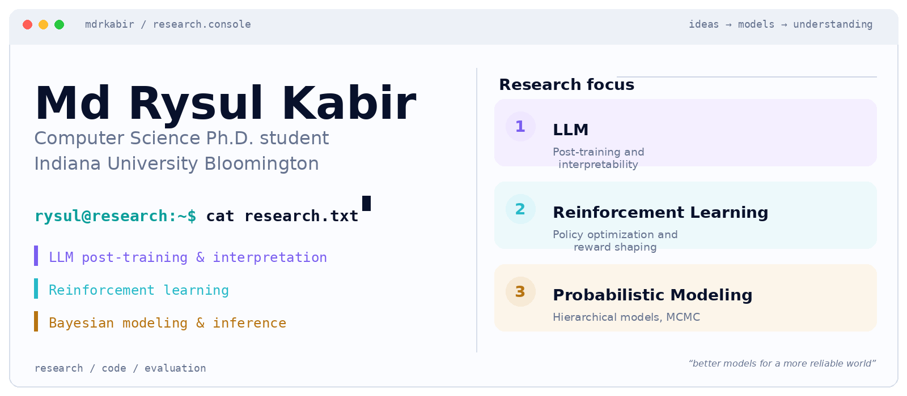
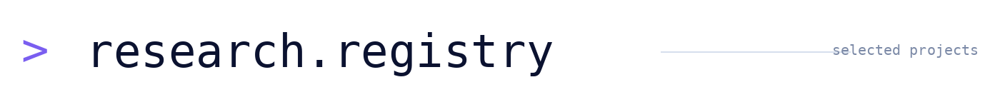
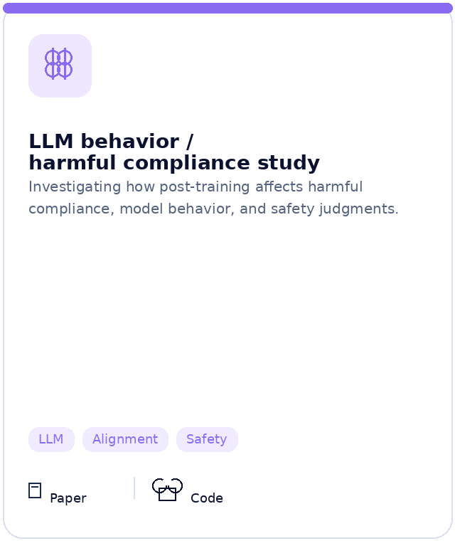
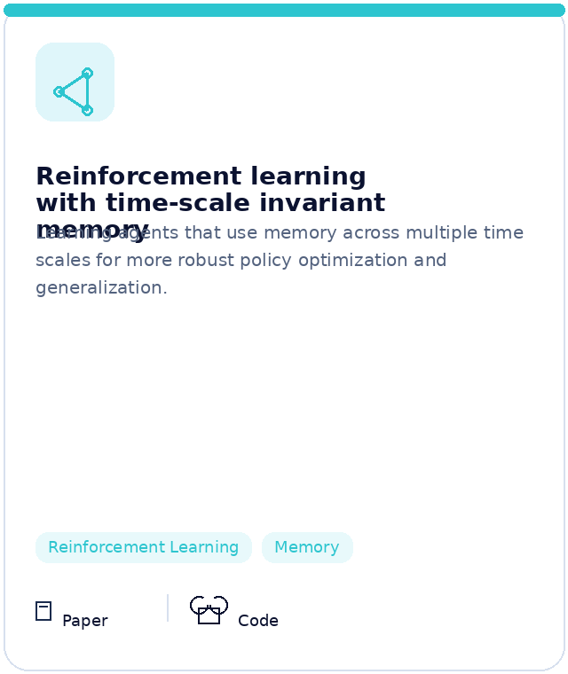
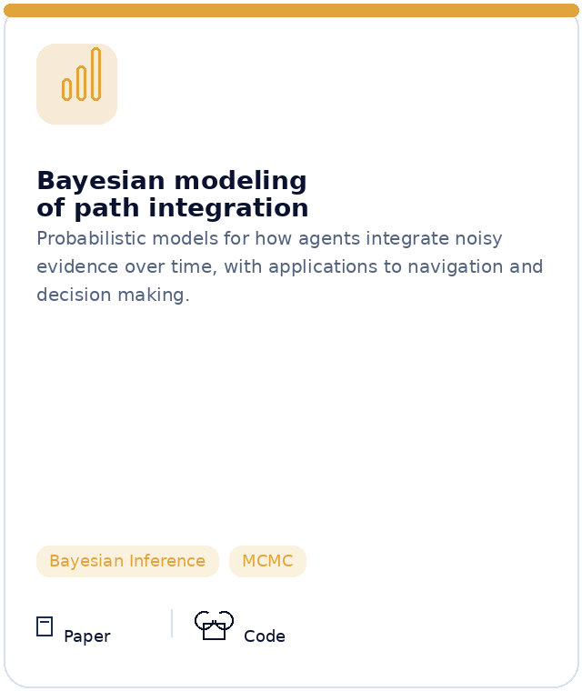
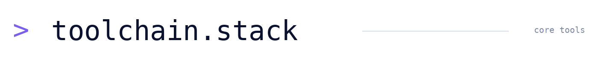

<picture>
  <source media="(prefers-color-scheme: dark)" srcset="assets/console-dark-static.png">
  <source media="(prefers-color-scheme: light)" srcset="assets/console-light-static.png">
  
</picture>

  <a href="https://scholar.google.com/citations?user=-BT9-3AAAAAJ&amp;hl=en"><picture>
    <source media="(prefers-color-scheme: dark)" srcset="assets/nav-scholar-dark.svg">
    <source media="(prefers-color-scheme: light)" srcset="assets/nav-scholar-light.svg">
    
  </picture></a>
  &nbsp;
  <a href="https://www.linkedin.com/in/mdrysulkabir/"><picture>
    <source media="(prefers-color-scheme: dark)" srcset="assets/nav-linkedin-dark.svg">
    <source media="(prefers-color-scheme: light)" srcset="assets/nav-linkedin-light.svg">
    
  </picture></a>
  &nbsp;
  <a href="https://github.com/mdrkabir?tab=repositories"><picture>
    <source media="(prefers-color-scheme: dark)" srcset="assets/nav-repositories-dark.svg">
    <source media="(prefers-color-scheme: light)" srcset="assets/nav-repositories-light.svg">
    
  </picture></a>

I am a **Computer Science Ph.D. student at Indiana University Bloomington**, working on **LLM post-training and evaluation, reinforcement learning, and Bayesian modeling**. My research focuses on how learning methods and internal representations shape model behavior, reliability, and interpretability.

<picture>
  <source media="(prefers-color-scheme: dark)" srcset="assets/heading-research-dark.png">
  <source media="(prefers-color-scheme: light)" srcset="assets/heading-research-light.png">
  
</picture>

Ongoing research at the intersection of learning, reasoning, and uncertainty.

<table>
  <tr>
    <td align="center" valign="top" width="33%">
      <picture>
        <source media="(prefers-color-scheme: dark)" srcset="assets/card-01-dark.png">
        <source media="(prefers-color-scheme: light)" srcset="assets/card-01-light.png">
        
      </picture> 
      <a href="https://arxiv.org/abs/2604.18510"><b>Paper ↗</b></a>
    </td>
    <td align="center" valign="top" width="33%">
      <picture>
        <source media="(prefers-color-scheme: dark)" srcset="assets/card-02-dark.png">
        <source media="(prefers-color-scheme: light)" srcset="assets/card-02-light.png">
        
      </picture> 
      <a href="https://ojs.aaai.org/index.php/AAAI/article/view/32124"><b>Paper ↗</b></a> &nbsp;·&nbsp; <a href="https://github.com/cogneuroai/RL-with-scale-invariant-memory"><b>Code ↗</b></a>
    </td>
    <td align="center" valign="top" width="33%">
      <picture>
        <source media="(prefers-color-scheme: dark)" srcset="assets/card-03-dark.png">
        <source media="(prefers-color-scheme: light)" srcset="assets/card-03-light.png">
        
      </picture> 
      <a href="https://doi.org/10.1126/sciadv.adw6404"><b>Paper ↗</b></a> &nbsp;·&nbsp; <a href="https://github.com/cogneuroai/Bayesian-hierarchical-model-for-PI"><b>Code ↗</b></a>
    </td>
  </tr>
</table>

<picture>
  <source media="(prefers-color-scheme: dark)" srcset="assets/heading-tools-dark.png">
  <source media="(prefers-color-scheme: light)" srcset="assets/heading-tools-light.png">
  
</picture>

Core libraries, systems, and languages I regularly use.

### LLM & Deep Learning
<table>
<tr>
<td align="center"><a href="https://pytorch.org/"><picture><source media="(prefers-color-scheme: dark)" srcset="assets/logo-pytorch-dark.svg"><source media="(prefers-color-scheme: light)" srcset="assets/logo-pytorch-light.svg"></picture> PyTorch</a></td>
<td align="center"><a href="https://huggingface.co/docs/transformers/"><picture><source media="(prefers-color-scheme: dark)" srcset="assets/logo-transformers-dark.svg"><source media="(prefers-color-scheme: light)" srcset="assets/logo-transformers-light.svg"></picture> Transformers</a></td>
<td align="center"><a href="https://github.com/verl-project/verl"><picture><source media="(prefers-color-scheme: dark)" srcset="assets/logo-verl-dark.svg"><source media="(prefers-color-scheme: light)" srcset="assets/logo-verl-light.svg"></picture> verl</a></td>
<td align="center"><a href="https://github.com/vllm-project/vllm"><picture><source media="(prefers-color-scheme: dark)" srcset="assets/logo-vllm-dark.svg"><source media="(prefers-color-scheme: light)" srcset="assets/logo-vllm-light.svg"></picture> vLLM</a></td>
<td align="center"><a href="https://www.tensorflow.org/"><picture><source media="(prefers-color-scheme: dark)" srcset="assets/logo-tensorflow-dark.svg"><source media="(prefers-color-scheme: light)" srcset="assets/logo-tensorflow-light.svg"></picture> TensorFlow</a></td>
</tr>
</table>

### Bayesian Modeling & Data Science
<table>
<tr>
<td align="center"><a href="https://num.pyro.ai/"><picture><source media="(prefers-color-scheme: dark)" srcset="assets/logo-numpyro-dark.svg"><source media="(prefers-color-scheme: light)" srcset="assets/logo-numpyro-light.svg"></picture> NumPyro</a></td>
<td align="center"><a href="https://docs.jax.dev/"><picture><source media="(prefers-color-scheme: dark)" srcset="assets/logo-jax-dark.svg"><source media="(prefers-color-scheme: light)" srcset="assets/logo-jax-light.svg"></picture> JAX</a></td>
<td align="center"><a href="https://scikit-learn.org/"><picture><source media="(prefers-color-scheme: dark)" srcset="assets/logo-scikit-learn-dark.svg"><source media="(prefers-color-scheme: light)" srcset="assets/logo-scikit-learn-light.svg"></picture> scikit-learn</a></td>
<td align="center"><a href="https://numpy.org/"><picture><source media="(prefers-color-scheme: dark)" srcset="assets/logo-numpy-dark.svg"><source media="(prefers-color-scheme: light)" srcset="assets/logo-numpy-light.svg"></picture> NumPy</a></td>
<td align="center"><a href="https://pandas.pydata.org/"><picture><source media="(prefers-color-scheme: dark)" srcset="assets/logo-pandas-dark.svg"><source media="(prefers-color-scheme: light)" srcset="assets/logo-pandas-light.svg"></picture> Pandas</a></td>
<td align="center"><a href="https://matplotlib.org/"><picture><source media="(prefers-color-scheme: dark)" srcset="assets/logo-matplotlib-dark.svg"><source media="(prefers-color-scheme: light)" srcset="assets/logo-matplotlib-light.svg"></picture> Matplotlib</a></td>
<td align="center"><a href="https://seaborn.pydata.org/"><picture><source media="(prefers-color-scheme: dark)" srcset="assets/logo-seaborn-dark.svg"><source media="(prefers-color-scheme: light)" srcset="assets/logo-seaborn-light.svg"></picture> Seaborn</a></td>
</tr>
</table>

### Compute & Development
<table>
<tr>
<td align="center"><a href="https://slurm.schedmd.com/"><picture><source media="(prefers-color-scheme: dark)" srcset="assets/logo-slurm-dark.svg"><source media="(prefers-color-scheme: light)" srcset="assets/logo-slurm-light.svg"></picture> Slurm / HPC</a></td>
<td align="center"><a href="https://www.kernel.org/"><picture><source media="(prefers-color-scheme: dark)" srcset="assets/logo-linux-dark.svg"><source media="(prefers-color-scheme: light)" srcset="assets/logo-linux-light.svg"></picture> Linux</a></td>
<td align="center"><a href="https://www.gnu.org/software/bash/"><picture><source media="(prefers-color-scheme: dark)" srcset="assets/logo-shell-dark.svg"><source media="(prefers-color-scheme: light)" srcset="assets/logo-shell-light.svg"></picture> Bash / Zsh</a></td>
<td align="center"><a href="https://www.docker.com/"><picture><source media="(prefers-color-scheme: dark)" srcset="assets/logo-docker-dark.svg"><source media="(prefers-color-scheme: light)" srcset="assets/logo-docker-light.svg"></picture> Docker</a></td>
<td align="center"><a href="https://cloud.google.com/compute"><picture><source media="(prefers-color-scheme: dark)" srcset="assets/logo-gcp-dark.svg"><source media="(prefers-color-scheme: light)" srcset="assets/logo-gcp-light.svg"></picture> GCP</a></td>
<td align="center"><a href="https://git-scm.com/"><picture><source media="(prefers-color-scheme: dark)" srcset="assets/logo-git-dark.svg"><source media="(prefers-color-scheme: light)" srcset="assets/logo-git-light.svg"></picture> Git</a></td>
</tr>
</table>

### Languages
<table>
<tr>
<td align="center"><a href="https://www.python.org/"><picture><source media="(prefers-color-scheme: dark)" srcset="assets/logo-python-dark.svg"><source media="(prefers-color-scheme: light)" srcset="assets/logo-python-light.svg"></picture> Python</a></td>
<td align="center"><a href="https://isocpp.org/"><picture><source media="(prefers-color-scheme: dark)" srcset="assets/logo-cpp-dark.svg"><source media="(prefers-color-scheme: light)" srcset="assets/logo-cpp-light.svg"></picture> C++</a></td>
<td align="center"><a href="https://www.iso.org/standard/82075.html"><picture><source media="(prefers-color-scheme: dark)" srcset="assets/logo-c-dark.svg"><source media="(prefers-color-scheme: light)" srcset="assets/logo-c-light.svg"></picture> C</a></td>
<td align="center"><a href="https://www.postgresql.org/docs/current/tutorial-sql.html"><picture><source media="(prefers-color-scheme: dark)" srcset="assets/logo-sql-dark.svg"><source media="(prefers-color-scheme: light)" srcset="assets/logo-sql-light.svg"></picture> SQL</a></td>
<td align="center"><a href="https://www.r-project.org/"><picture><source media="(prefers-color-scheme: dark)" srcset="assets/logo-r-dark.svg"><source media="(prefers-color-scheme: light)" srcset="assets/logo-r-light.svg"></picture> R</a></td>
<td align="center"><a href="https://www.mathworks.com/products/matlab.html"><picture><source media="(prefers-color-scheme: dark)" srcset="assets/logo-matlab-dark.svg"><source media="(prefers-color-scheme: light)" srcset="assets/logo-matlab-light.svg"></picture> MATLAB</a></td>
</tr>
</table>

### Databases
<table>
<tr>
<td align="center"><a href="https://www.postgresql.org/"><picture><source media="(prefers-color-scheme: dark)" srcset="assets/logo-postgresql-dark.svg"><source media="(prefers-color-scheme: light)" srcset="assets/logo-postgresql-light.svg"></picture> PostgreSQL</a></td>
<td align="center"><a href="https://www.mysql.com/"><picture><source media="(prefers-color-scheme: dark)" srcset="assets/logo-mysql-dark.svg"><source media="(prefers-color-scheme: light)" srcset="assets/logo-mysql-light.svg"></picture> MySQL</a></td>
</tr>
</table>

`focus` → LLM post-training · model behavior · evaluation
