### Hi! 👋

I'm a **Computer Science Ph.D. student at Indiana University Bloomington**, interested in how models learn, behave, and make decisions. My work spans **LLM post-training and interpretability**, **Reinforcement learning**, and **Probabilistic modeling of cognitive and behavioral data**.

### Research 🧠

- **LLM post-training:** Supervised fine-tuning and reinforcement learning.
- **Evaluation & interpretability:** Model behavior, safety evaluation, and representation analysis.
- **Reinforcement learning:** Time-scale invariant memory and temporal decision-making.
- **Bayesian modeling & inference:** Hierarchical models for cognitive and behavioral data.

### Links 🔗

  <a href="https://mdrkabir.github.io/homepage/"><picture><source media="(prefers-color-scheme: dark)" srcset="assets/links/website-dark.svg"><source media="(prefers-color-scheme: light)" srcset="assets/links/website.svg"></picture></a> &nbsp;
  <a href="https://scholar.google.com/citations?user=-BT9-3AAAAAJ&amp;hl=en"><picture><source media="(prefers-color-scheme: dark)" srcset="assets/links/scholar-dark.svg"><source media="(prefers-color-scheme: light)" srcset="assets/links/scholar.svg"></picture></a> &nbsp;
  <a href="https://www.linkedin.com/in/mdrysulkabir/"><picture><source media="(prefers-color-scheme: dark)" srcset="assets/links/linkedin-dark.svg"><source media="(prefers-color-scheme: light)" srcset="assets/links/linkedin.svg"></picture></a>

### Tech Stack 🛠️

#### Deep learning & LLMs

  <a href="https://pytorch.org/" title="PyTorch"><picture><source media="(prefers-color-scheme: dark)" srcset="assets/stack/pytorch-dark.png"><source media="(prefers-color-scheme: light)" srcset="assets/stack/pytorch-light.png"></picture></a>
  <a href="https://huggingface.co/docs/transformers/" title="Transformers"><picture><source media="(prefers-color-scheme: dark)" srcset="assets/stack/transformers-dark.png"><source media="(prefers-color-scheme: light)" srcset="assets/stack/transformers-light.png"></picture></a>
  <a href="https://github.com/verl-project/verl" title="verl"><picture><source media="(prefers-color-scheme: dark)" srcset="assets/stack/verl-dark.png"><source media="(prefers-color-scheme: light)" srcset="assets/stack/verl-light.png">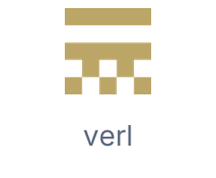</picture></a>
  <a href="https://github.com/vllm-project/vllm" title="vLLM"><picture><source media="(prefers-color-scheme: dark)" srcset="assets/stack/vllm-dark.png"><source media="(prefers-color-scheme: light)" srcset="assets/stack/vllm-light.png"></picture></a>
  <a href="https://www.tensorflow.org/" title="TensorFlow"><picture><source media="(prefers-color-scheme: dark)" srcset="assets/stack/tensorflow-dark.png"><source media="(prefers-color-scheme: light)" srcset="assets/stack/tensorflow-light.png">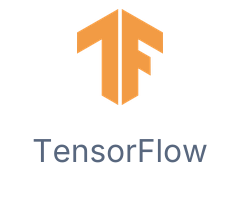</picture></a>

#### Bayesian modeling & data science

  <a href="https://num.pyro.ai/" title="NumPyro"><picture><source media="(prefers-color-scheme: dark)" srcset="assets/stack/numpyro-dark.png"><source media="(prefers-color-scheme: light)" srcset="assets/stack/numpyro-light.png">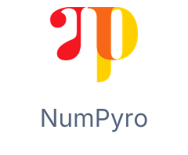</picture></a>
  <a href="https://docs.jax.dev/" title="JAX"><picture><source media="(prefers-color-scheme: dark)" srcset="assets/stack/jax-dark.png"><source media="(prefers-color-scheme: light)" srcset="assets/stack/jax-light.png"></picture></a>
  <a href="https://scikit-learn.org/" title="scikit-learn"><picture><source media="(prefers-color-scheme: dark)" srcset="assets/stack/scikit-learn-dark.png"><source media="(prefers-color-scheme: light)" srcset="assets/stack/scikit-learn-light.png">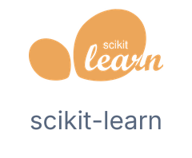</picture></a>
  <a href="https://numpy.org/" title="NumPy"><picture><source media="(prefers-color-scheme: dark)" srcset="assets/stack/numpy-dark.png"><source media="(prefers-color-scheme: light)" srcset="assets/stack/numpy-light.png"></picture></a>
  <a href="https://pandas.pydata.org/" title="pandas"><picture><source media="(prefers-color-scheme: dark)" srcset="assets/stack/pandas-dark.png"><source media="(prefers-color-scheme: light)" srcset="assets/stack/pandas-light.png">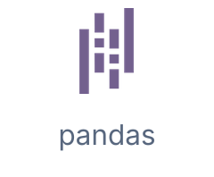</picture></a>
  <a href="https://matplotlib.org/" title="Matplotlib"><picture><source media="(prefers-color-scheme: dark)" srcset="assets/stack/matplotlib-dark.png"><source media="(prefers-color-scheme: light)" srcset="assets/stack/matplotlib-light.png"></picture></a>
  <a href="https://seaborn.pydata.org/" title="Seaborn"><picture><source media="(prefers-color-scheme: dark)" srcset="assets/stack/seaborn-dark.png"><source media="(prefers-color-scheme: light)" srcset="assets/stack/seaborn-light.png"></picture></a>

#### Compute & development

  <a href="https://slurm.schedmd.com/" title="Slurm / HPC"><picture><source media="(prefers-color-scheme: dark)" srcset="assets/stack/slurm-dark.png"><source media="(prefers-color-scheme: light)" srcset="assets/stack/slurm-light.png">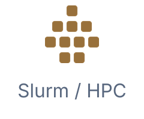</picture></a>
  <a href="https://www.kernel.org/" title="Linux"><picture><source media="(prefers-color-scheme: dark)" srcset="assets/stack/linux-dark.png"><source media="(prefers-color-scheme: light)" srcset="assets/stack/linux-light.png"></picture></a>
  <a href="https://www.gnu.org/software/bash/" title="Bash / Zsh"><picture><source media="(prefers-color-scheme: dark)" srcset="assets/stack/shell-dark.png"><source media="(prefers-color-scheme: light)" srcset="assets/stack/shell-light.png"></picture></a>
  <a href="https://www.docker.com/" title="Docker"><picture><source media="(prefers-color-scheme: dark)" srcset="assets/stack/docker-dark.png"><source media="(prefers-color-scheme: light)" srcset="assets/stack/docker-light.png"></picture></a>
  <a href="https://cloud.google.com/compute" title="Google Cloud"><picture><source media="(prefers-color-scheme: dark)" srcset="assets/stack/gcp-dark.png"><source media="(prefers-color-scheme: light)" srcset="assets/stack/gcp-light.png"></picture></a>
  <a href="https://git-scm.com/" title="Git"><picture><source media="(prefers-color-scheme: dark)" srcset="assets/stack/git-dark.png"><source media="(prefers-color-scheme: light)" srcset="assets/stack/git-light.png">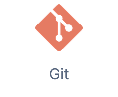</picture></a>

#### Languages

  <a href="https://www.python.org/" title="Python"><picture><source media="(prefers-color-scheme: dark)" srcset="assets/stack/python-dark.png"><source media="(prefers-color-scheme: light)" srcset="assets/stack/python-light.png">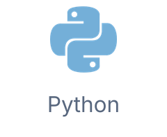</picture></a>
  <a href="https://isocpp.org/" title="C++"><picture><source media="(prefers-color-scheme: dark)" srcset="assets/stack/cpp-dark.png"><source media="(prefers-color-scheme: light)" srcset="assets/stack/cpp-light.png">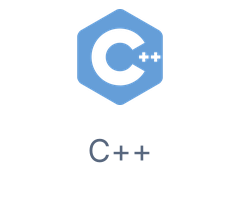</picture></a>
  <a href="https://www.iso.org/standard/82075.html" title="C"><picture><source media="(prefers-color-scheme: dark)" srcset="assets/stack/c-dark.png"><source media="(prefers-color-scheme: light)" srcset="assets/stack/c-light.png">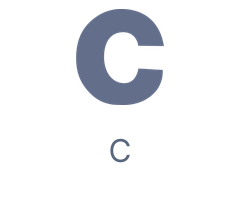</picture></a>
  <a href="https://www.postgresql.org/docs/current/tutorial-sql.html" title="SQL"><picture><source media="(prefers-color-scheme: dark)" srcset="assets/stack/sql-dark.png"><source media="(prefers-color-scheme: light)" srcset="assets/stack/sql-light.png">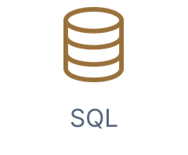</picture></a>
  <a href="https://www.r-project.org/" title="R"><picture><source media="(prefers-color-scheme: dark)" srcset="assets/stack/r-dark.png"><source media="(prefers-color-scheme: light)" srcset="assets/stack/r-light.png"></picture></a>
  <a href="https://www.mathworks.com/products/matlab.html" title="MATLAB"><picture><source media="(prefers-color-scheme: dark)" srcset="assets/stack/matlab-dark.png"><source media="(prefers-color-scheme: light)" srcset="assets/stack/matlab-light.png">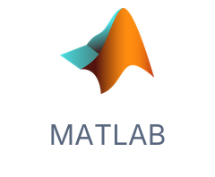</picture></a>

#### Databases

  <a href="https://www.postgresql.org/" title="PostgreSQL"><picture><source media="(prefers-color-scheme: dark)" srcset="assets/stack/postgresql-dark.png"><source media="(prefers-color-scheme: light)" srcset="assets/stack/postgresql-light.png"></picture></a>
  <a href="https://www.mysql.com/" title="MySQL"><picture><source media="(prefers-color-scheme: dark)" srcset="assets/stack/mysql-dark.png"><source media="(prefers-color-scheme: light)" srcset="assets/stack/mysql-light.png"></picture></a>

