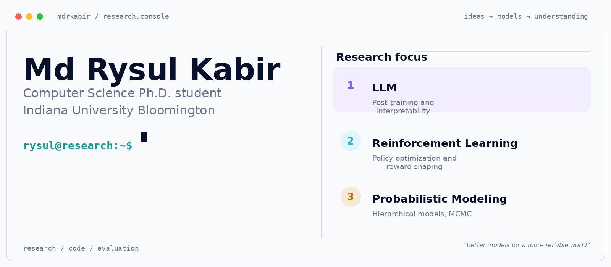

<!-- Compact layout: use only exact light/dark theme selectors.
Do not restore mobile image sources: their artwork is not designed for desktop widths.
The console is 640 x 277 CSS px at full width; it scales down on narrower screens. -->

<picture>
              <source media="(prefers-color-scheme: dark)" srcset="assets/console-dark.gif">
  <source media="(prefers-color-scheme: light)" srcset="assets/console-light.gif">
  
</picture>

<a href="https://scholar.google.com/citations?user=-BT9-3AAAAAJ&amp;hl=en"><picture>
  <source media="(prefers-color-scheme: dark)" srcset="assets/nav-scholar-dark.svg">
  <source media="(prefers-color-scheme: light)" srcset="assets/nav-scholar-light.svg">
  
</picture></a>
<a href="https://www.linkedin.com/in/mdrysulkabir/"><picture>
  <source media="(prefers-color-scheme: dark)" srcset="assets/nav-linkedin-dark.svg">
  <source media="(prefers-color-scheme: light)" srcset="assets/nav-linkedin-light.svg">
  
</picture></a>
<a href="https://github.com/mdrkabir?tab=repositories"><picture>
  <source media="(prefers-color-scheme: dark)" srcset="assets/nav-repositories-dark.svg">
  <source media="(prefers-color-scheme: light)" srcset="assets/nav-repositories-light.svg">
  
</picture></a>

I am a **Computer Science Ph.D. student at Indiana University Bloomington**, working on LLM post-training and evaluation, reinforcement learning, and Bayesian modeling. I study how learning methods and internal representations shape model behavior, reliability, and interpretability.

<h3><samp>&gt; research.registry</samp></h3>

<table>
<tr><td width="680">
<samp>01 / model.behavior &nbsp; · &nbsp; arXiv / 2026</samp> 
<strong><a href="https://arxiv.org/abs/2604.18510" title="Behind Harmful Compliance: Behavioral and Mechanistic Divergence Across LLM Jailbreaks">Behind Harmful Compliance</a></strong>
</td></tr>
</table>

Comparing SFT, RLVR, and abliteration to understand how post-training changes harmful compliance, model capabilities, and safety judgments.

**[Paper ↗](https://arxiv.org/abs/2604.18510)** &nbsp; · &nbsp; `LLMs` · `Post-training` · `Evaluation`

<table>
<tr><td width="680">
<samp>02 / memory.agents &nbsp; · &nbsp; AAAI / 2025</samp> 
<strong><a href="https://ojs.aaai.org/index.php/AAAI/article/view/32124" title="Deep Reinforcement Learning with Time-Scale Invariant Memory">Memory in reinforcement learning</a></strong>
</td></tr>
</table>

Integrating time-scale invariant memory into deep RL agents to study learning across different temporal scales.

**[Paper ↗](https://ojs.aaai.org/index.php/AAAI/article/view/32124)** &nbsp; · &nbsp; **[Code ↗](https://github.com/cogneuroai/RL-with-scale-invariant-memory)** &nbsp; · &nbsp; `Reinforcement learning` · `Memory` · `Temporal reasoning`

<table>
<tr><td width="680">
<samp>03 / bayesian.navigation &nbsp; · &nbsp; Science Advances</samp> 
<strong><a href="https://doi.org/10.1126/sciadv.adw6404" title="Path integration impairments reveal early cognitive changes in Subjective Cognitive Decline">Bayesian models of navigation</a></strong>
</td></tr>
</table>

Hierarchical Bayesian modeling of path integration to examine individual and group differences in navigation.

**[Paper ↗](https://doi.org/10.1126/sciadv.adw6404)** &nbsp; · &nbsp; **[Code ↗](https://github.com/cogneuroai/Bayesian-hierarchical-model-for-PI)** &nbsp; · &nbsp; `Bayesian inference` · `Cognitive modeling` · `NumPyro`

<!-- TOOLCHAIN:START -->
<h3><samp>&gt; toolchain</samp></h3>

<!-- Native ruby annotations keep the logos above their small captions without CSS, tables, or badge boxes. -->

<h4>LLM &amp; deep learning</h4>

<ruby>PyTorch<rt><a href="https://pytorch.org/" title="PyTorch"><picture><source media="(prefers-color-scheme: dark)" srcset="assets/logo-pytorch-dark.svg"><source media="(prefers-color-scheme: light)" srcset="assets/logo-pytorch-light.svg"></picture></a></rt></ruby> &nbsp;
<ruby>Transformers<rt><a href="https://huggingface.co/docs/transformers/" title="HF Transformers"><picture><source media="(prefers-color-scheme: dark)" srcset="assets/logo-transformers-dark.svg"><source media="(prefers-color-scheme: light)" srcset="assets/logo-transformers-light.svg"></picture></a></rt></ruby> &nbsp;
<ruby>verl<rt><a href="https://github.com/verl-project/verl" title="verl"><picture><source media="(prefers-color-scheme: dark)" srcset="assets/logo-verl-dark.svg"><source media="(prefers-color-scheme: light)" srcset="assets/logo-verl-light.svg"></picture></a></rt></ruby> &nbsp;
<ruby>vLLM<rt><a href="https://github.com/vllm-project/vllm" title="vLLM"><picture><source media="(prefers-color-scheme: dark)" srcset="assets/logo-vllm-dark.png"><source media="(prefers-color-scheme: light)" srcset="assets/logo-vllm-light.png"></picture></a></rt></ruby> &nbsp;
<ruby>TensorFlow<rt><a href="https://www.tensorflow.org/" title="TensorFlow"><picture><source media="(prefers-color-scheme: dark)" srcset="assets/logo-tensorflow-dark.svg"><source media="(prefers-color-scheme: light)" srcset="assets/logo-tensorflow-light.svg"></picture></a></rt></ruby> &nbsp;

<h4>Bayesian modeling &amp; data science</h4>

<ruby>NumPyro<rt><a href="https://num.pyro.ai/" title="NumPyro"><picture><source media="(prefers-color-scheme: dark)" srcset="assets/logo-numpyro.png"><source media="(prefers-color-scheme: light)" srcset="assets/logo-numpyro.png"></picture></a></rt></ruby> &nbsp;
<ruby>JAX<rt><a href="https://docs.jax.dev/" title="JAX"><picture><source media="(prefers-color-scheme: dark)" srcset="assets/logo-jax.png"><source media="(prefers-color-scheme: light)" srcset="assets/logo-jax.png"></picture></a></rt></ruby> &nbsp;
<ruby>scikit-learn<rt><a href="https://scikit-learn.org/" title="scikit-learn"><picture><source media="(prefers-color-scheme: dark)" srcset="assets/logo-scikit-learn-dark.svg"><source media="(prefers-color-scheme: light)" srcset="assets/logo-scikit-learn-light.svg"></picture></a></rt></ruby> &nbsp;
<ruby>NumPy<rt><a href="https://numpy.org/" title="NumPy"><picture><source media="(prefers-color-scheme: dark)" srcset="assets/logo-numpy-dark.svg"><source media="(prefers-color-scheme: light)" srcset="assets/logo-numpy-light.svg"></picture></a></rt></ruby> &nbsp;
<ruby>Pandas<rt><a href="https://pandas.pydata.org/" title="Pandas"><picture><source media="(prefers-color-scheme: dark)" srcset="assets/logo-pandas-dark.svg"><source media="(prefers-color-scheme: light)" srcset="assets/logo-pandas-light.svg"></picture></a></rt></ruby> &nbsp;
<ruby>Matplotlib<rt><a href="https://matplotlib.org/" title="Matplotlib"><picture><source media="(prefers-color-scheme: dark)" srcset="assets/logo-matplotlib-dark.svg"><source media="(prefers-color-scheme: light)" srcset="assets/logo-matplotlib-light.svg"></picture></a></rt></ruby> &nbsp;
<ruby>Seaborn<rt><a href="https://seaborn.pydata.org/" title="Seaborn"><picture><source media="(prefers-color-scheme: dark)" srcset="assets/logo-seaborn-dark.svg"><source media="(prefers-color-scheme: light)" srcset="assets/logo-seaborn-light.svg"></picture></a></rt></ruby> &nbsp;

<h4>Compute &amp; development</h4>

<ruby>Slurm / HPC<rt><a href="https://slurm.schedmd.com/" title="Slurm / HPC"><picture><source media="(prefers-color-scheme: dark)" srcset="assets/logo-slurm-dark.svg"><source media="(prefers-color-scheme: light)" srcset="assets/logo-slurm-light.svg"></picture></a></rt></ruby> &nbsp;
<ruby>Linux<rt><a href="https://www.kernel.org/" title="Linux"><picture><source media="(prefers-color-scheme: dark)" srcset="assets/logo-linux-dark.svg"><source media="(prefers-color-scheme: light)" srcset="assets/logo-linux-light.svg"></picture></a></rt></ruby> &nbsp;
<ruby>Bash / Zsh<rt><a href="https://www.gnu.org/software/bash/" title="Bash / Zsh"><picture><source media="(prefers-color-scheme: dark)" srcset="assets/logo-shell-dark.svg"><source media="(prefers-color-scheme: light)" srcset="assets/logo-shell-light.svg"></picture></a></rt></ruby> &nbsp;
<ruby>Docker<rt><a href="https://www.docker.com/" title="Docker"><picture><source media="(prefers-color-scheme: dark)" srcset="assets/logo-docker-dark.svg"><source media="(prefers-color-scheme: light)" srcset="assets/logo-docker-light.svg"></picture></a></rt></ruby> &nbsp;
<ruby>GCP<rt><a href="https://cloud.google.com/compute" title="GCP Compute Engine"><picture><source media="(prefers-color-scheme: dark)" srcset="assets/logo-gcp-dark.svg"><source media="(prefers-color-scheme: light)" srcset="assets/logo-gcp-light.svg"></picture></a></rt></ruby> &nbsp;
<ruby>Git<rt><a href="https://git-scm.com/" title="Git"><picture><source media="(prefers-color-scheme: dark)" srcset="assets/logo-git-dark.svg"><source media="(prefers-color-scheme: light)" srcset="assets/logo-git-light.svg"></picture></a></rt></ruby> &nbsp;

<h4>Languages</h4>

<ruby>Python<rt><a href="https://www.python.org/" title="Python"><picture><source media="(prefers-color-scheme: dark)" srcset="assets/logo-python-dark.svg"><source media="(prefers-color-scheme: light)" srcset="assets/logo-python-light.svg"></picture></a></rt></ruby> &nbsp;
<ruby>C++<rt><a href="https://isocpp.org/" title="C++"><picture><source media="(prefers-color-scheme: dark)" srcset="assets/logo-cpp-dark.svg"><source media="(prefers-color-scheme: light)" srcset="assets/logo-cpp-light.svg"></picture></a></rt></ruby> &nbsp;
<ruby>C<rt><a href="https://www.iso.org/standard/82075.html" title="C"><picture><source media="(prefers-color-scheme: dark)" srcset="assets/logo-c-dark.svg"><source media="(prefers-color-scheme: light)" srcset="assets/logo-c-light.svg"></picture></a></rt></ruby> &nbsp;
<ruby>SQL<rt><a href="https://www.postgresql.org/docs/current/tutorial-sql.html" title="SQL"><picture><source media="(prefers-color-scheme: dark)" srcset="assets/logo-sql-dark.svg"><source media="(prefers-color-scheme: light)" srcset="assets/logo-sql-light.svg"></picture></a></rt></ruby> &nbsp;
<ruby>R<rt><a href="https://www.r-project.org/" title="R"><picture><source media="(prefers-color-scheme: dark)" srcset="assets/logo-r-dark.svg"><source media="(prefers-color-scheme: light)" srcset="assets/logo-r-light.svg"></picture></a></rt></ruby> &nbsp;
<ruby>MATLAB<rt><a href="https://www.mathworks.com/products/matlab.html" title="MATLAB"><picture><source media="(prefers-color-scheme: dark)" srcset="assets/logo-matlab.png"><source media="(prefers-color-scheme: light)" srcset="assets/logo-matlab.png"></picture></a></rt></ruby> &nbsp;

<h4>Databases</h4>

<ruby>PostgreSQL<rt><a href="https://www.postgresql.org/" title="PostgreSQL"><picture><source media="(prefers-color-scheme: dark)" srcset="assets/logo-postgresql-dark.svg"><source media="(prefers-color-scheme: light)" srcset="assets/logo-postgresql-light.svg"></picture></a></rt></ruby> &nbsp;
<ruby>MySQL<rt><a href="https://www.mysql.com/" title="MySQL"><picture><source media="(prefers-color-scheme: dark)" srcset="assets/logo-mysql-dark.svg"><source media="(prefers-color-scheme: light)" srcset="assets/logo-mysql-light.svg"></picture></a></rt></ruby> &nbsp;

<!-- TOOLCHAIN:END -->

`focus` → LLM post-training · model behavior · evaluation

<!-- Optional: add your website and résumé links here after supplying their public URLs. Matching nav-website-*.svg and nav-resume-*.svg assets are included. -->
